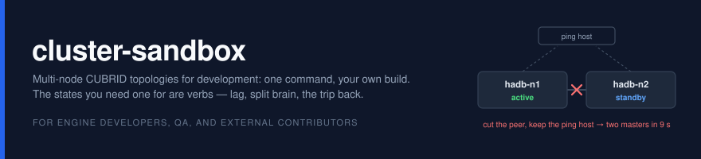
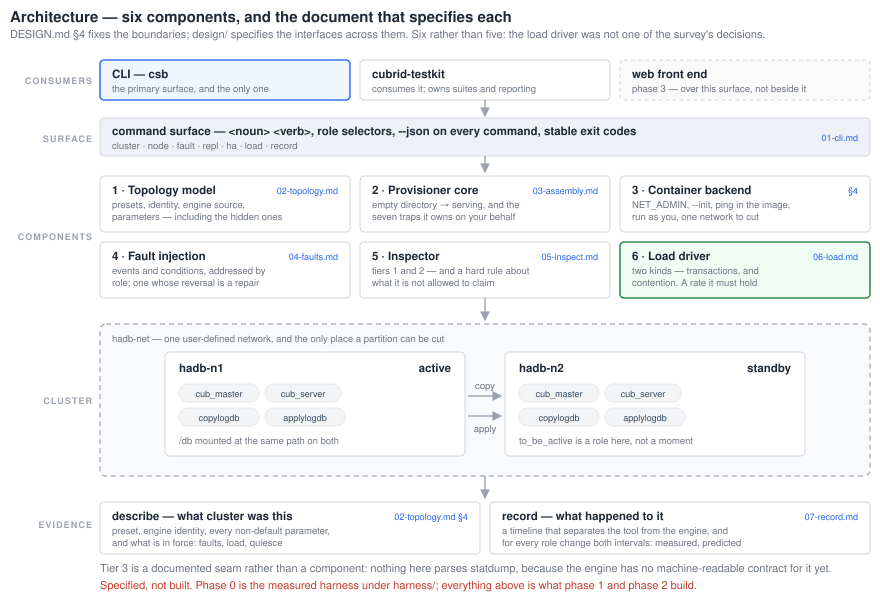

**cluster-sandbox** stands a multi-node CUBRID topology up in containers, from
one command and your own build. It also reproduces the states you actually need
a cluster for: a slave that has fallen behind, two nodes that both believe they
are master, and the return trip after a failover.

For engine developers, QA, and external contributors. Part of
[CUBRID Systems Research](https://github.com/cubrid-systems).

> **Where it is:** phase 0. The design is written and the assembly runs as a
> shell harness; the tool itself is not built yet — see [Status](#status).

## The surface being built

```
csb cluster create --preset ha --nodes 2 --build ~/cubrid/install.out
csb cluster status --json

csb fault partition master --keep ping-host    # split brain, on request
csb fault lag slave --stage apply              # one stage, not "slow"
csb load start --profile insert --rate 2000/s  # a rate it has to hold, and report
csb repl watch --interval 0.5s --out lag.tsv

csb ha failback --to hadb-n1                   # interactive; the policy is open
csb cluster describe --out cluster.yaml        # stands the same cluster up elsewhere
```

Every command has a `--json` form and a documented exit code, because
`cubrid-testkit` provisions through this surface rather than screen-scraping it.
Specified in [`docs/design/01-cli.md`](docs/design/01-cli.md) — **none of it runs
yet.** What runs today is the harness in [`harness/`](harness/).

## Why it exists

Answering a single HA question about a serial-cache change took a two-node
cluster built by hand. Every step of it was mechanical: two configuration files
per node, a four-step slave chain, a start ordering that fails quietly if you get
it wrong, and two traps that each cost an afternoon. None of it was written down
anywhere a newcomer would find.

The neighbouring tools each solve an adjacent problem:

| Tool | What it is | Why it is not this |
|---|---|---|
| `cubrid-contrib/sandbox` | a single-container build shell | one node, and it builds the engine rather than running a topology |
| `cubrid-contrib/docker_for_ctp` | a two-container rig that drives CTP | a test rig against a released tarball |
| `cubrid-testkit` | the test harness succeeding CTP | treats HA as a workload it runs, not one it provisions |
| `cubrid-operator` | production Kubernetes deployment | operational lifecycle, not local iteration |

Nobody provisions a development topology. That is the gap.

## Architecture

Six components and two artifacts. [`docs/DESIGN.md`](docs/DESIGN.md) §4 fixes the
boundaries between them, [`docs/design/`](docs/design/) specifies what crosses
each one, and the diagram says which document that is.



The sixth component is the late one. Phase 0 assumed a scenario brings its own
traffic; the field's own switchover measurement sat unusable for four years
because of exactly that assumption, so the load driver is a component with a rate
contract rather than a loop in each scenario's shell script
([`docs/design/06-load.md`](docs/design/06-load.md)).

## Status

**Phase 0 complete.** The manual assembly is written down and runs
(`harness/lib.sh`), and the three questions the design was unsure about were
answered by measurement rather than by reading:

| Question | Answer | Where |
|---|---|---|
| Does split brain need a broken configuration? | **No** — a correctly configured cluster reaches two masters in 9 s when the ping host survives the partition | [`docs/findings/split-brain.md`](docs/findings/split-brain.md) |
| How is replication lag injected, and does the heartbeat allow it? | Suspend a replication stage; the heartbeat watches process *existence*, not progress, and does not interfere | [`docs/findings/replication-lag.md`](docs/findings/replication-lag.md) |
| Is the return to the original master mechanically possible? | Yes — restored in 2 s with no row loss. What is *not* settled is the policy around it | [`docs/findings/failback.md`](docs/findings/failback.md) |

**Decided since:** the provisioner is written in **Go**, and anything an operator
reads, edits, or runs on a real host stays shell
([ADR-001](docs/design/ADR-001-implementation-language.md)).

**Open, and not this project's to close:** what the technical team requires of the
return trip to the original master. [`harness/failback.sh`](harness/failback.sh)
encodes this project's guess at that sequence, with a decision point at every step
where the guess is a guess. It goes to them to be marked up, and the marks are the
requirement set.

## Layout

```
docs/
  DESIGN.md          the design document — problem, goals, architecture, decisions
  ROADMAP.md         phases, milestones, and where the project actually is
  design/            01 command surface · 02 topology · 03 assembly · 04 faults
                     05 inspection · 06 load · 07 the run record · ADR-001 language
  requirements/      what the field asks for, from CUBRID's internal tracker
  survey/            PostgreSQL, MySQL, MongoDB, TiDB, and the CUBRID gap analysis
  findings/          what running it showed — including where it contradicted the design
  assets/            the banner and the architecture diagram
harness/
  Dockerfile · entrypoint.sh · lib.sh  the Phase-0 spike: one node, and the
                                       four-step assembly that makes two of them
  oq9-splitbrain.sh · oq7-lag.sh       the experiments
  failback.sh · failback-demo.sh       the failback artifact, and a rig that proves it runs
  results/                             captured console output and samples
```

## Running the harness

Needs Docker and a built CUBRID install tree (`ENGINE=<path to install.out>`;
the default points at a local build). Each script builds its own network and
containers and removes them on exit.

```bash
cd harness
bash oq9-splitbrain.sh A|B|C     # ~4 min per arm
bash oq7-lag.sh                  # ~7 min
bash failback-demo.sh            # ~5 min — sets up the failed-over state, then runs failback.sh
```

Nodes run with `--cap-add=NET_ADMIN` and `--init`, both for reasons the harness
README records: the fault mechanisms are route and qdisc operations, and without
a reaping PID 1 `cubrid heartbeat stop` never returns.

## Relationships

- **`cubrid-testkit`** consumes this tool: it owns suites, dispatch, and
  reporting; this project owns the environment they run on.
- **`cubrid-operator`** is not a dependency. It serves production Kubernetes;
  this serves a developer setting up an environment. The connection is later and
  narrower — operational testing.
- **CUBRID Ops** owns engine-internal metrics. This project leaves a documented
  seam and does not build a second collector.
